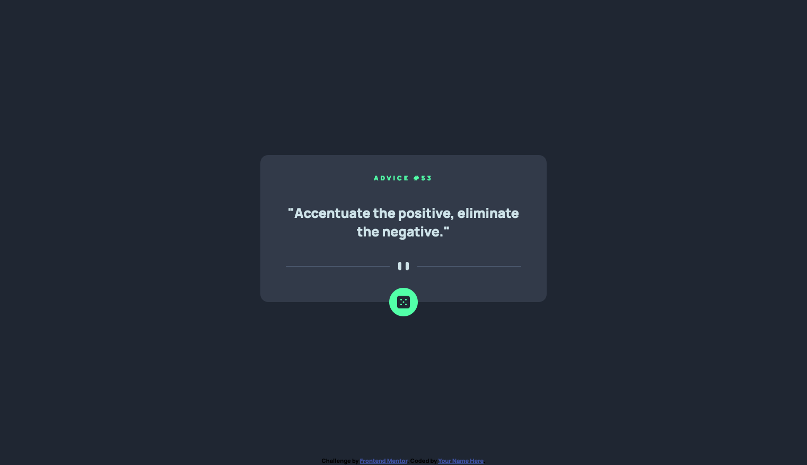

# Frontend Mentor - Advice generator app solution

This is a solution to the [Advice generator app challenge on Frontend Mentor](https://www.frontendmentor.io/challenges/advice-generator-app-QdUG-13db). Frontend Mentor challenges help you improve your coding skills by building realistic projects.

## Table of contents

- [Overview](#overview)
  - [The challenge](#the-challenge)
  - [Screenshot](#screenshot)
  - [Links](#links)
- [My process](#my-process)
  - [Built with](#built-with)
  - [What I learned](#what-i-learned)
  - [Continued development](#continued-development)
  - [Useful resources](#useful-resources)
- [Author](#author)

## Overview

### The challenge

Users should be able to:

- View the optimal layout for the app depending on their device's screen size
- See hover states for all interactive elements on the page
- Generate a new piece of advice by clicking the dice icon

### Screenshot



### Links

- Solution URL: [GitHub](https://github.com/martinw0/advice-generator)
- Live Site URL: [GitHub Pages](https://martinw0.github.io/advice-generator/)

## My process

### Built with

- Semantic HTML5 markup
- CSS custom properties
- Flexbox
- Mobile-first workflow
- SCSS
- JS

### What I learned

How to do an HTTP request in JS:

```js
    request.open('GET', 'https://api.adviceslip.com/advice');
    request.onload = function () {
        var data = JSON.parse(this.response);
    };
    request.send();
```

### Continued development

- Improve JS and do comprehensive code
- Focus on Semantic

### Useful resources

- [box shadow generator](https://html-css-js.com/css/generator/box-shadow/)
- [How to connect to an API with JavaScript](https://www.taniarascia.com/how-to-connect-to-an-api-with-javascript/)

### Author

- Frontend Mentor - [@martinw0](https://www.frontendmentor.io/profile/martinw0)
- Twitter - [@LeWalletM](https://www.twitter.com/LeWalletM)
